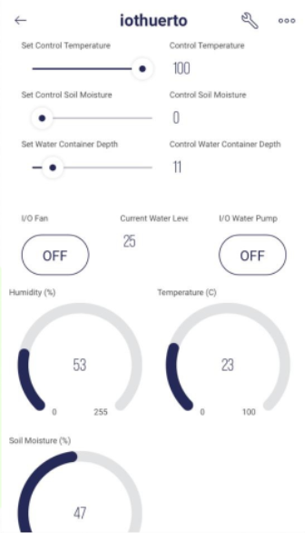

# Digital Garden

## Internet of Things implementation

### Creators

- Manuel Alejandro Preciado Morán
- Luis Alejandro Rodríguez González
- Natalia Rodríguez González
- John Paul Cueva Osete

### The Garden

A digital garden is an ideal tool for those who love nature and live busy lives. This tool allows them to consume natural foods, automating and optimizing plant care. It is adaptable and scalable.

[Demo](https://www.youtube.com/watch?v=_UWSPOPDPb0) (in Spanish)

### Requirements

- ESP8266 NodeMCU Microchip
- DHT11 Sensor
- HC-SR04 Ultrasonic Sensor
- FC-28 Soil Moisture Sensor
- Two relays
  - Water pump
  - Fan
  - Energy source
- LED

### How to use

1. Install the following drivers on your Arduino IDE:
   - ESP8266WiFi.h
   - BlynkSimpleEsp8266.h
   - FirebaseESP8266.h
   - DHT.h
2. Connect all the components as outlined in lines 24, 29-34.
   - It is important that the soil moisture sensor is connected to A0.
   - Ensure your LED is not a high power one.
   - Ensure both the fan and the pump are connected to the relays negatively, so when the device boots up, they're disabled.
3. Set up Blynk variable types as outlined in lines 80-83, 113-119 on Blynk. Set up a panel to control it ([see below](#panel)).
4. Fill lines 2-4, 12-14, 17-19 with data to connect to Wi-Fi, Blynk and Firebase.
5. Flash microchip.

### Panel
